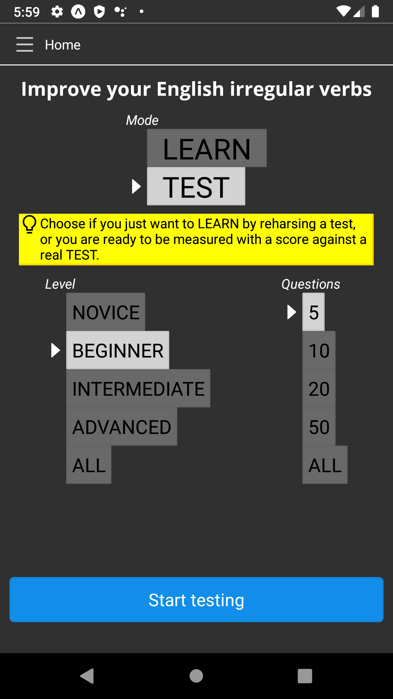

Get help from our Android app to easily learn English irregular verbs!

See [Play Store](https://play.google.com/store/apps/details?id=com.edugenia.irregular).

## Features

* free and ad-free
* neat and searchable collection of all verbs always available
* audio with pronunciation
* learn without assessments or challenge yourself with tests
* you choose the number of questions
* 4 levels, from the easiest and most frequent to the rarest verbs
* you can repeat a test with only the questions you got wrong

## Support

Get in touch with us at [info@edugenia.com](mailto:info@edugenia.com).
