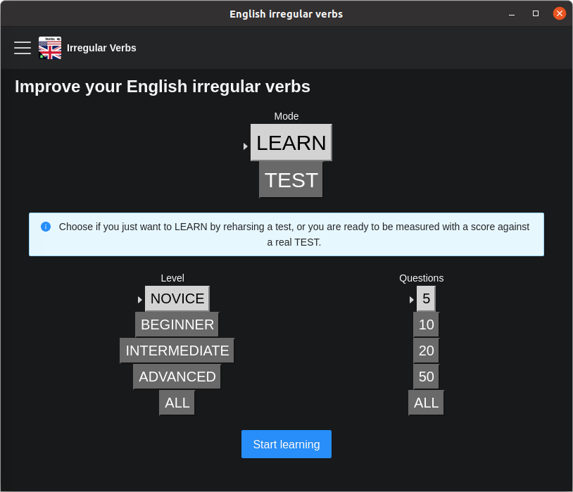

Easily learn English irregular verbs from a desktop application.

## Features

* free and ad-free
* neat and searchable collection of all verbs
* audio with pronunciation
* learn without assessments or challenge yourself with tests
* you choose the number of questions
* 4 levels, from the easiest and most frequent to the rarest verbs
* you can repeat a test with only the questions you got wrong

## Download

### Windows

<a class="button button--primary button--lg" href="/artifact/English irregular verbs-1.0.1 Setup.exe">
   Download .exe
</a>

### Ubuntu (Linux Debian)

<a class="button button--primary button--lg" href="/artifact/irregular-e_1.0.1_amd64.deb">
   Download .deb
</a>

## Support

Get in touch with us at [support@edugenia.com](mailto:support@edugenia.com).