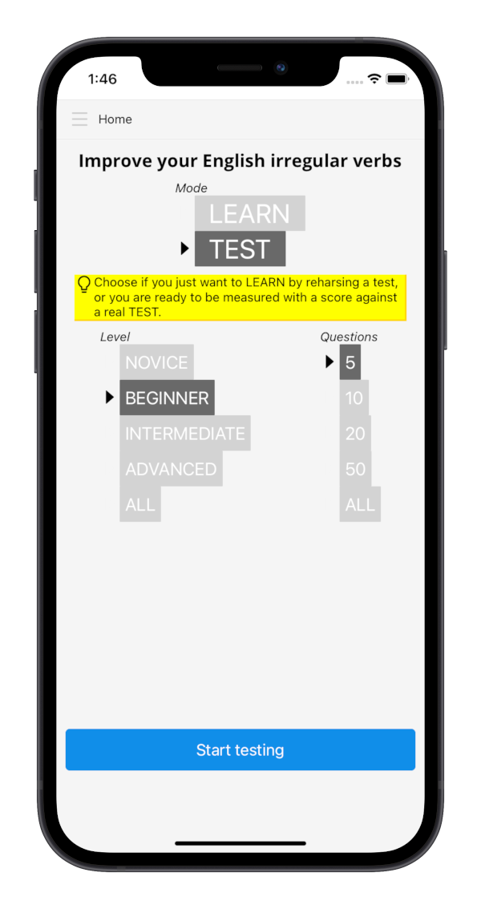

Get help from our mobile app to easily learn English irregular verbs!
Available on both [iOS](/docs/irregulars#app-store) and [Android](/docs/irregulars#google-play).

## Features

* free and ad-free
* neat and searchable collection of all verbs always available
* audio with pronunciation
* learn without assessments or challenge yourself with tests
* you choose the number of questions
* 4 levels, from the easiest and most frequent to the rarest verbs
* you can repeat a test with only the questions you got wrong

## Download 

### App Store

<!-- src working in build -->

### Google Play

## Support

Get in touch with us at [support@edugenia.com](mailto:support@edugenia.com).